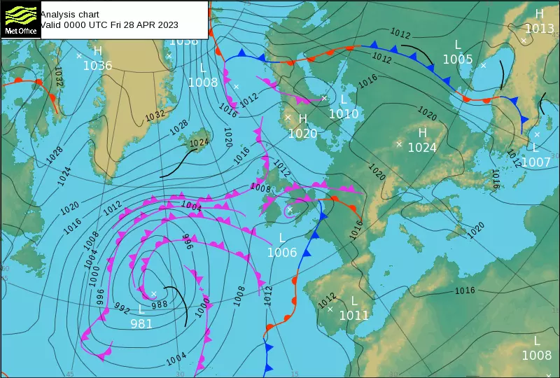

# Meteorology

Simply put, meteorology is the study of the weather, and thus it is very important for all those involved in aviation to have at least a basic understanding of how the weather affects our operations.

## Weather Systems

The weather we experience is always part of a larger weather system. A weather system is defined by the air pressure (at sea level) at the centre of the weather system and the position of that point on earth. A system is defined as low pressure if the air pressure at the centre of the system is less than the average air pressure at sea level (defined in the International Standard Atmosphere as 1013.25 hPa, 29.92 inHg or 730 mmHg). Similarly, a system is defined as high pressure if the air pressure at the centre is higher than average. Weather systems are typically shown on a 'Synoptic Chart'.

In the Northern Hemisphere, the wind created by a low pressure system will travel in an anti-clockwise direction around the centre - conversely, the wind created by a high pressure system will travel clockwise around its centre. This is reversed in the Southern Hemisphere (low pressure travels clockwise, high pressure travels anti-clockwise)

The wind strength created at a point is related to the pressure gradient at that point (i.e. how much pressure is changing as you move away from the centre of the system): a higher pressure gradient will cause higher wind strength. The pressure gradient can be seen on a Synoptic Chart by the distance between 'isobars' - an isobar is a line showing where the air pressure is equal, at every point along an isobar, air pressure is equal.

A weather system can also contain 'weather fronts' - a weather front is the boundary between different air masses, and each type has certain characteristics:

**Cold Front:** A cold front is located on the warm side of a significant temperature gradient. Cold fronts often bring rain and sometimes heavy thunderstorms.
**Warm Front:** A warm front is located at the leading edge of a homogeneous advancing mass of warm air. Warm fronts often bring lighter rain, increasing as the front approaches and fog, occasionally thunderstorms can be embedded in the warm air mass behind the front.
**Occluded Front:** An Occluded front is created when a cold front overtakes a warm front usually forming around low pressure systems. Occluded fronts may bring a wide variety of weather conditions.

There are other weather fronts, however, these are the most common and simplest to understand.



In the above synoptic chart, blue fronts are cold fronts, red fronts are warm fronts, and pink fronts are occluded fronts, the centre of a pressure system is marked with an 'x' and the pressure at that point is labelled with L or H depending on whether its low or high pressure, and the pressure in Hectopascals (hPa), isobars are in black.

## METARs

Most airfields have a weather reporting station recording information relevant to aviation, this is reported to pilots every 30 minutes, these are known as METeorological Aerodrome Reports (METARs) and use a coded format to increase information density, a METAR should include:
- the airfield ICAO code
- the date and time of the reading
- the wind direction and speed
- the visibility
- general weather conditions
- any cloud layers
- temperature and dewpoint
- the airfield [QNH](./altimetry.md)

An example METAR is shown below:

```EGPH 281050Z 34003KT 270V030 6000 -RA FEW010 BKN025 OVC039 11/09 Q1011```

This METAR can be decoded as follows:

| Section | Meaning                                                                         |
| ------- | ------------------------------------------------------------------------------- |
| EGPH    | Recorded at Edinburgh Airport                                                   |
| 281050Z | Recorded at 1050 zulu (UTC) on the 28th                                         |
| 34003KT | Wind is coming from a bearing of 340 (Magnetic) at a speed of 3 knots           |
| 270V030 | Wind direction is varying between 270 and 030                                   |
| 6000    | Visibility is at 6000 metres                                                    |
| -       | Following weather condition is light                                            |
| RA      | Rain (-RA together means light rain)                                            |
| FEW010  | FEW cloud layer (1-2 out of 8 sky coverage) at 1,000ft Above Ground Level (AGL) |
| BKN025  | BKN (broken) cloud layer (5-7 out of 8 sky coverage) at 2,500ft AGL             |
| OVC039  | OVC (overcast) cloud layer (8 out of 8 sky coverage) at 3,900ft AGL             |
| 11/09   | Temperature of 11 celsius, dewpoint of 9 celsius                                |
| Q1101   | QNH is 1011 Hectopascals (hPa)                                                  |

When wind gusts differ from the average by more than 10 knots, wind is given as follows: 34003G15KT (in this case the gusts are at 15 knots).

The altitude of a cloud layer is the cloud base (i.e. the bottom of the cloud layer), the lowest BKN or OVC layer indicates the cloud ceiling - cloud layers may also be labelled as SCT (Scattered) which is 3-4 out of 8 sky coverage

Other notes may be added to a METAR, most notably:

- `NOSIG` which means that no significant changes are expected within the next two hours
- `TEMPO` conditions are expected to change for half of the next two hour period
- `CAVOK` short for Ceiling And Visibility OK and indicates that there is no cloud below 5,000ft AGL, and visibility is higher than 10km (shown in the visibility section as 9999)

## TAF

TODO: short answer: while METAR provides the current weather, TAF is a forecast

# Further Reading & References

The information used here can be found in:

- [UK Met Office](https://www.metoffice.gov.uk/)
- [Wikipedia Weather Fronts](https://en.wikipedia.org/wiki/Weather_front)
- [Wikipedia METAR](https://en.wikipedia.org/wiki/METAR)
