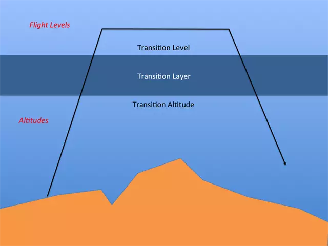

# Altimetry

An altimeter is an instrument designed to measure the altitude of an object above a fixed level. The most useful altimeters on aircraft are known as Barometric Altimeters, these work by comparing the (static) pressure around the object to a fixed calibration point, known as the altimeter setting. There are three main types of calibration point:

- QNH
- QFE
- QNE

These names allow pilots and controllers to know which altitude reference they should be using, when spoken over the radio, each letter is said individually, **not** using the phonetic alphabet.

The unit of the altimeter setting may change across the world, usually Hectopascals (hPa) or Millibars (mb), however, Inches of Mercury (inHg) are used in the United States of America, Canada and Japan - inHg is also the most common unit in DCS. Meteorologists may also use Millimetres of Mercury (mmHg) but that is rare in aviation.

## Preface

The names for each of these altimeter settings are derived from Radiotelegraphy "Q-codes". While they weren't originally initialisms, the initialisms presented here are useful as a memory aid.

## QNH

QNH stands for Query Nautical Height and refers to the **current** air pressure at sea level. This is then used by an aircraft's altimeter to calculate its altitude above sea level. The Radiotelephony Proword associated with QNH is 'Altitude'.

!!! example ATC
	BAW134 descend **altitude** 3,000

This is an instruction for BAW134 to descend to 3,000ft above sea level.

QNH may change depending on current [meteorological conditions](./meteorology.md).

## QFE

QFE stands for Query Field Elevation, as the name may suggest, QFE refers to the **current** air pressure at airfield elevation - usually measured from the end of the active runway. This can be used by on aircraft to determine its altitude above the airfield. QFE is much less commonly used than QNH, however, knowledge of it is still useful. The Radiotelephony Proword associated with QFE is 'Height'.

!!! example ATC
	BAW134 descend **height** 3,000

This is an instruction for BAW134 to descend to 3,000ft above the airfield, therefore, their altitude above sea level will be 3,000ft + the airfield elevation

QFE may change depending on current [meteorological conditions](./meteorology.md), and will change depending on airfield elevation, therefore, it is usually used in the near vicinity of an airfield.

## QNE

QNE stands for Query Nautical Equivalent, a more common name for this altimeter setting is "standard pressure" this is because it is the **average** air pressure at sea level as defined by the International Civil Aviation Organisation (ICAO) Standard Atmosphere (ICAO Doc 7488-CD). QNE is typically used at higher altitudes since that is where barometric altimeters become less accurate when compared to true altitude and, more importantly, aircraft travel long distances at higher altitudes, and QNE is independent of airfield elevation or meteorological conditions, so it is useful for all aircraft to use the same standard. The Radiotelephony Proword associated with QNE is 'Flight Level' - a Flight Level is given as three digits in hundreds of feet and often abbreviated to 'FL'.

!!! example ATC
	BAW134 climb **flight level** 110

This is an instruction for BAW134 to climb to 11,000ft above sea level using standard pressure.

The value of QNE in the different units:

- Hectopascals (hPa): 1013.25 hPa
- Inches of Mercury (inHg): 29.92 inHg
- Millimetres of Mercury (mmHg): 730 mmHg

## Transition Altitude

At some point during an aircraft's flight, they may have to transition between QNH/QFE and QNE. The **altitude** at which an aircraft does this is known as the 'transition altitude'.

!!! note Note
	The transition altitude is only used when an aircraft is climbing

In North America (the United States of America and Canada) the transition altitude is fixed at 17,500ft above sea level, therefore, all (climbing) aircraft above 17,500ft above sea level (i.e. at or above FL180) are set to QNE and use flight levels, and all (climbing) aircraft below 18,000ft above sea level are set to QNH/QFE and therefore using altitude or height.

Across the world, the transition altitude may change significantly, each country may have its own standard, or it may vary from airfield to airfield, for example, at Paris Charles-De-Gaulles airport (LFPG), the transition altitude is 4,000ft above sea level.

## Transition Level

When an aircraft descends again, the aircraft will have to transition from QNE back to QNH/QFE. The **flight level** at which an aircraft does this is known as the 'transition level'.

!!! note Note
	The transition level is only used when an aircraft is descending

In North America, the transition level is fixed at FL180 (the 'same' as transition altitude), therefore, all (descending) aircraft above FL180 use QNE, and all (descending) aircraft below FL180 use QNH/QFE.

Similarly to transition altitude, across the world, transition level may change significantly, even by the hour! - however, the transition level MUST be equal or higher than transition altitude, the space in between is known as the 'transition layer' - this is important to remember as no aircraft should be maintaining an altitude within the transition layer.

# Further reading & References

All of the information here can be found in:

- [ICAO Doc 8168 Aircraft Operations Volume I: Flight Procedures](https://publicapps.caa.co.uk/docs/33/15-Ref09_Doc%208168%20PANS-OPS%20Vol%20I%20Flight%20Procedures.PDF)
- [UK Civil Air Publication (CAP) 493: Manual of Air Traffic Services](https://publicapps.caa.co.uk/docs/33/CAP%20493%20Edition%2010%20(28%20March%202022).pdf)
- [US FAA Order JO 7110.65](https://www.faa.gov/documentLibrary/media/Order/7110.65AA_ATC_Basic_dtd_4-20-23_FINAL.pdf)
- ICAO Doc 7488 Manual of the ICAO standard atmosphere
