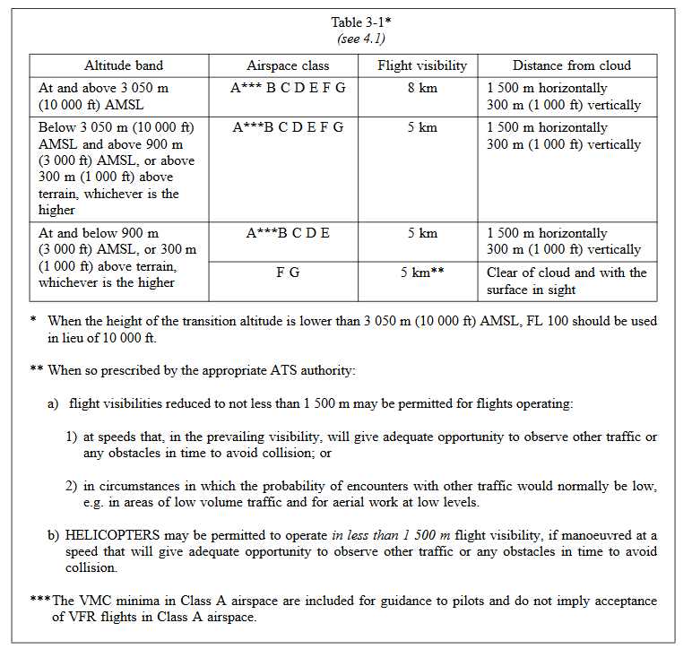

# Flight Rules

Flight rules are the rules, regulations & procedures used in aircraft flying in various conditions. The most common include:

- VFR (Visual Flight Rules)
- IFR (Instrument Flight Rules)
- SVFR (Special Visual Flight Rules)

## VFR

VFR stands for 'Visual Flight Rules', and as the name infers, this means flying using visual references. This can be a very simple navigation method of navigation, though requires Visual Meteorological Conditions (VMC). The VMC visibility and distance from cloud minima are contained in the table below (Table 3-1, ICAO Annex 2)

