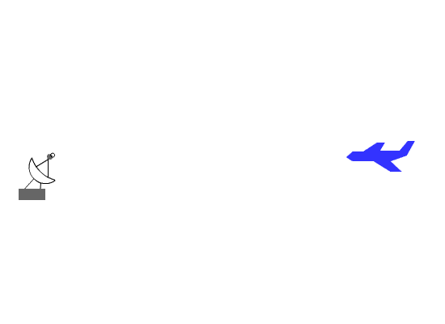

Radar is a system that allows for the determination of distance (range), angle (azimuth) and radial velocity of objects relative to the location of the radar system.

Radar systems can generally be split into two categories, both of which are used in aviation:

- Primary Surveillance Radar (PSR)
- Secondary Surveillance Radar (SSR)

## Primary Surveillance Radar

PSR is the traditional form of radar (usually realised as a pulse-doppler radar very similar to that found on modern fighter aircraft). This is where a pulse of radio waves are transmitted, they reflect off an object, and by recording where in the scan the pulse was transmitted, timing the pulse, and measuring the doppler shift of the returning pulse, distance, angle and radial velocity can be determined.

The information from a PSR is usually just displayed as a dot, however, if contact is maintained, previous locations can be used to calculate a track direction, and ground speed, this is why a contact that is turning's instantaneous track will be different from its radar track - something to keep in mind when looking at your scope. Each contact can then be classified with a callsign, 

## Secondary Surveillance Radar

The other category of radar is SSR, instead of transmitting a pulse and awaiting its return, SSR transmits a weak interrogation signal that is detected by a piece of equipment onboard the aircraft known as the aircraft's transponder. When interogated by an SSR a transponder will transmit certain information about the aircraft (this will vary depending on the type of transponder fitted to the aircraft). This information can then also be used to display aircraft location to a controller. Transponders can contain codes that are transmitted in addition to position information and can be used for classification. Transponder codes are usually octal numbers (i.e. digits go from 0-7) and most commonly 4 digits. If an aircraft needs to be individually identified, it should have a unique SSR code (known as a squawk code).

### (Civilian) Types of Transponder

There are three types of civilian transponder, Modes A,C, and S. 

The brevity for transponder operation is "Squawk", followed by the code or mode to be set. If a mode is not specified, mode 3/A is assummed. 

Aircraft flying in higher traffic areas generally require at least a Mode C transponder and are required to "squawk mode C" on takeoff.

Each transponder also has IDENT functionality, this will 'light-up' an aircraft on a controller's screen for easier identification.

**Mode A**

Transmits position information and an identifying code.

Mode A codes are 4 digit octal codes. Mode A is identical to military mode 3A.

Mode A is usually combined with Mode C to provide postion, code and alitutde information.

**Mode C**

Transmits pressure altitude. Usually combined with Mode A to provide postion, code and altitude information

**Mode S**

Transmits a unique 24-bit address assigned to each aircraft and all Mode A/C information. Also can be used for data exchange.

### (Military) Types of Transponder

Military transponders have additional information over civillian transponders that aids them in performing military tasks, these transponders form part of the Identify Friend or Foe (IFF) system.

There are several brevity word used when operating military transponders. "Parrot" is the combined word for modes 1, 2, 3/A and 3/C, "India" is the word for mode 4. 

Modes 1-3 are unencrypted, meaning that they can be interrogated by any properly configred SSR, mode 4 will only reply to a properly encrypted interrogation pulse, meaning it can be used to identify friendlies and cannot be used by enemies to gain position information. 

**Mode 1** (Military only)

Provides only a 2-digit octal code, the first digit can be 0-7, however the second digit can only be 0-3.

Mode 2 is commonly used as a "mission code" which is used to identify the aircraft type or mission.

**Mode 2** (Military only)

Provides only a 4-digit octal code, usually used for unit code or tail number.

**Mode 3/A**

Same as civilian Mode A.

**Mode 3/C**

Same as civilian Mode C.

**Mode 4** (Military only)

Provides a 3-pulse reply, the delay is based on the encrypted challenge, will only reply to aircraft of the same coalition. 

**Mode S**

Same as civilian Mode S.

### Specified Codes

In certain circumstances, an aircraft may communicate a situation using an SSR code, the standards specified by ICAO are:

- 7500 - Unlawful interference (Hijacking)
- 7600 - Radio failure
- 7700 - General Emergency

## Further reading

More can be read on this topic at:

- [Skybrary](https://www.skybrary.aero/articles/transponder)
- [Wikipedia SSR](https://en.wikipedia.org/wiki/Secondary_surveillance_radar)
- [Wikipedia PSR](https://en.wikipedia.org/wiki/Primary_radar)

