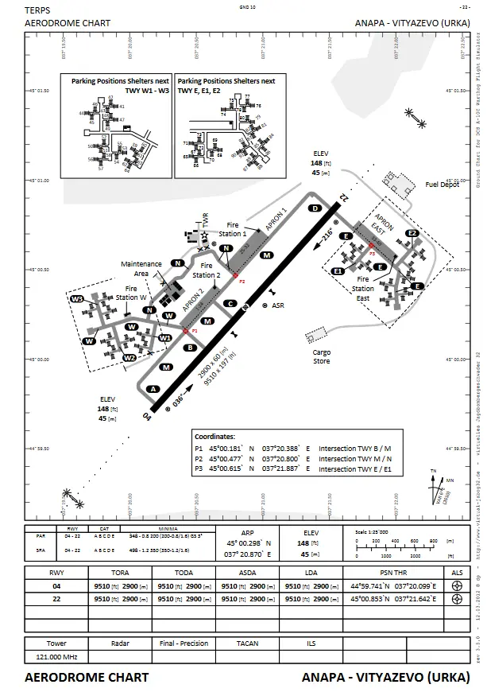

!!! info "Work-in-Progress"
	This page is very much work-in-progress, and is nowhere near completed.

#Taxi

Taxiing is the movement of an aircraft on the ground, under it's own power. On a controlled airfeild, the taxiways and directions an aircraft follows is the responsibility of the ground movement controller, and is to be given in a taxi clearance.

!!! note "Note"
    If an IFR clearance is required, this is to be requested by the pilot before taxi.

In any taxi clearance, a clearance limit is given. This is where the pilot is to stop, unless a futher clearance limit is given. The clearance limit is frequently a holding point of the active runway, though - depending on many factors, including traffic, active runways and standard procedures - can be any point on a manouvering area or apron.

!!! note "Note"
    'Hold short' is also frequently used. This means 'stop before' a given taxiway or runway, and is used when there isn't an applicable holding point. 'Hold position' can also be given, and this means the pilot should immediately stop their aircraft.

Also given in any taxi clearance are the taxiways for a pilot to follow. These can be found on a ground chart (as seen below), and are pronounced in the phonetic alphabet.

!!!example "Example"
    Pilot: Anapa Ground, HORNET1, request taxi. Controller: HORNET1, taxi hold short runway 04 via taxiways M, D. Pilot: Taxi hold short runway 04 via taxiways M, D, HORNET1.

The phrase "Follow the..." can also be used. This is useful for a pilot, to make navigation on the ground easier, but this is to be used with caution, as a pilot could inadverdantly follow an aircraft past a clearance limit.

!!!example "Example"
    Pilot: Anapa Ground, HORNET1, request taxi. Controller: HORNET1, taxi hold short runway 04 via taxiways M, D, follow the C130. Pilot: Taxi hold short runway 04 via taxiways M, D, follow the C130 HORNET1.
