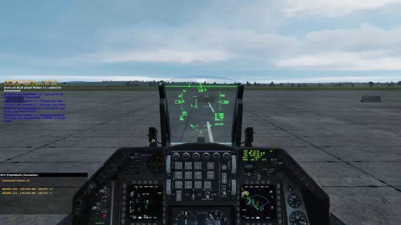
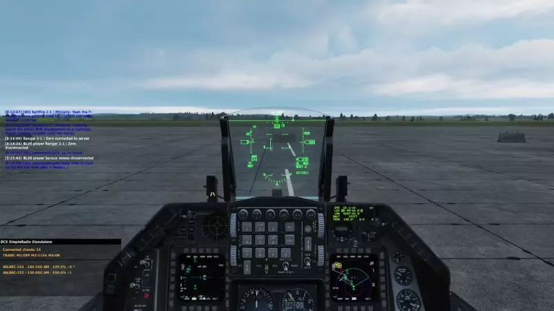
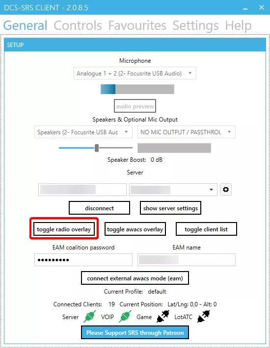

# SQUAWK and Mode 3 Transponder Operation

## Transponder Codes

Transponder codes are encoded in [octal (base 8)](https://en.wikipedia.org/wiki/Octal), and thus only fit the range `0-7`. This means any squawk given with an `8` or `9` in it, is invalid and will not be accepted by your transponder.

## LotAtc

### Labels

 

`%(transponder)` can be added to label html to display the current transponder. You can select only the mode 3 portion of the transponder code by using `%(transponder|mode3)`.

Example HTML with Transponder Mode 3:

```html
%(name|10)
%(transponder|mode3)
%(alti_short) %(type)
```

### IDENT

 

 A controller or C2 may elect to ask for a pilot to IDENT, which will highlight them with a flashing red border in LotAtc. This can be useful for doing checkins/alpha checks, as it highlights the aircraft's position without having to find them in the object menu, or look for their alpha check manually.

### Emergency Codes

 

When squawking `7700` or `7600`, the relevant aircraft will be highlighted by a red block which flashes periodically. 


Their mode 3 transponder label will also read `EMER` if `7700` or `RDO` if `7600` is selected by the pilot.

## F14 Tomcat

!!! todo Todo
	This section has not been completed yet, but you can assist by [adding to the thread on discord](https://discord.com/channels/1099799536416862330/1102555371404525640), or by submitting a pull request to update this section.

## F16C Viper

### Mode 3 Transponder



!!! note
	The Viper does not differentiate between mode 1 and 3 within the cockpit. You will use both the mode 1 and 3 section to input your mode 3 squawk (4 digits).

=== "Walkthrough"

    1. Switch the `IFF Master Knob` to **NORM**
    2. Input your designated/desired squawk using the rollers under Mode 1 and Mode 3.

=== "Checklist"
    ```
    IFF MASTER KNOB ..... NORM
    IFF Mode 1/3 Selector ..... CODE
    ```

### IDENT



=== "Walkthrough"

    1. Press the `IFF IDENT` button located on the left side dash.

=== "Checklist"
    ```
    IFF MASTER KNOB ..... NORM
    IFF IDENT ..... PRESS
    ```

## F/A 18C Hornet

### Mode 3 Transponder


=== "Walkthrough"

    1. Press the `IFF` button on the **UFC**.
    2. Press the `On/Off` switch on the **UFC** if you do not see the mode options populated.
    3. Press the `3 C` option button on the **UFC**, to select the mode 3 configuration for editing.
    4. Input your designated or desired SQUAWK.
    5. Press `ENT`.

=== "Checklist"
    ```
    IFF ..... ON
    Mode 3C ..... ON
    Mode 3C ..... CODE
    ```

### IDENT

 

=== "Walkthrough"

    1. Press the `I/P` pushbutton on the **UFC**.

    *You do not need to hold this down for operation.*

=== "Checklist"

    ```
    IFF ..... ON
    Mode 3C ..... ON
    I/P Pushbutton ..... HOLD 1 SECOND
    ```

## Mirage F1

### Mode 3 Transponder

 

=== "Walkthrough"

    1. Locate the IFF control panel.
    2. Set the IFF Master knob to standby.
    3. Enter your SQUAWK into the Mode 3A section using the number rollers.
    4. Set the `Mode 1/2/3A/C` to on.
    5. Set the `Mode 4 "Password" Knob` to A or B depending on preference. Default to `A`.
    6. Set the `Mode 4 Switch` to on.
    7. Before taking off, or at ATC request, set the `IFF Master` switch to on.

=== "Checklist"

    During Start:

    ```
    - IFF Master Knob ..... STBY
    - Mode 1 ..... Code
    - Mode 3 ..... Code
    - Mode 1 / 2 / 3A / C Switch .... ON
    - Mode 4 "Password" Knob ..... A / B
    - Mode 4 Switch..... ON
    ```

    Before Takeoff:

    ```
    IFF Master Knob ..... N
    ```

### IDENT

 

=== "Walkthrough"

    1. Hold the Position/Identification switch in the up position to IDENT.

=== "Checklist"

    ```
    Position/Identification Switch .... HOLD UP
    ```

## SRS Overlay

### Mode 3 Transponder Setup




=== "Walkthrough"

    1. Show the **SRS Radio Overlay** before connecting, or alt tab and show it from **SRS**.
    2. Click the red dot next to transponder to switch it on. You will need to have electrical power and typically engines started to do this, but it varies per type.
    3. Input your designated/desired squawk into the section under mode 3, and hit enter to confirm, or deselect the text input.

=== "Checklist"
    ```
    Transponder ..... ON (GREEN CIRCLE)
    Mode 3 ..... CODE
    ```

### IDENT

 

=== "Walkthrough"

    1. Press the IDENT button (while grey) to IDENT.
    2. Wait for the controller to either find you and continue relevant procedure, or aknowledge the IDENT.
    3. Press the IDENT button again (while it is green) to stop IDENT.

=== "Checklist"

    ```
    Transponder ..... ON
    IDENT ..... TOGGLE ON
    IDENT ..... TOGGLE OFF
    ```
